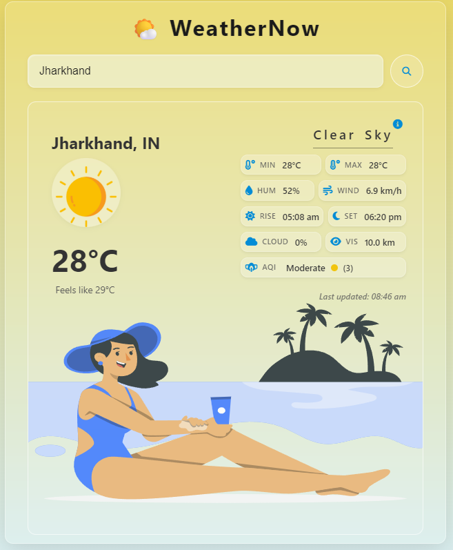

# 🌤️ Weather App — Real-Time Weather Dashboard

> 🔗 Live Demo: [Weather App Live](https://weather-app-rosy-tau-s36kbp54xk.vercel.app/)  
> 📦 Repository: [weather-app](https://github.com/yourusername/weather-app)


A modern and responsive weather application that provides accurate real-time weather updates with a clean glassmorphism-inspired user interface.

This Weather App delivers live weather insights for cities worldwide using the OpenWeather API with a focus on simplicity, speed, and user experience.

---

# 📸 Preview



---

# ✨ Features

| Category | Features |
|----------|----------|
| 🔍 Search | Search weather instantly by city name |
| 🌡️ Weather Data | Displays temperature, humidity, wind speed, visibility, and cloud details |
| 🌅 Sun Details | Sunrise and sunset timing display |
| 🌫️ AQI | Real-time Air Quality Index integration |
| 🎨 Dynamic UI | Weather-based icons and live visual updates |
| 💾 Persistence | Saves last searched city using LocalStorage |
| 🔄 Smart Restore | Restores previous weather data after refresh |
| ⚡ Performance | Prevents duplicate API requests during active fetches |
| 🌐 Network Awareness | Detects online/offline network status |
| ❌ Error Handling | Gracefully handles invalid city searches |
| ✨ UX | Smooth animations and glassmorphism design |
| 📱 Responsive | Fully optimized for mobile, tablet, and desktop |
| ♿ Accessibility | Accessible interactions using ARIA labels |

---

# 🛠️ Tech Stack

- **HTML5** — Semantic structure  
- **CSS3** — Styling and responsiveness  
- **JavaScript (ES6+)** — Core application logic  
- **OpenWeather API** — Live weather data  
- **Fetch API** — Network requests  
- **LocalStorage** — Data persistence  
- **Vercel** — Deployment and hosting  

---

# 🚀 Getting Started

## Clone Repository

```bash
git clone https://github.com/yourusername/weather-app.git](https://github.com/sumit-bera-0805/weather-app.git

Open Project Folder
cd weather-app
Run the Application
Open index.html directly in your browser
OR
Use the Live Server extension in VS Code

📌 Future Improvements


7-Day Weather Forecast


Hourly Forecast Support


Current Location Detection


Celsius / Fahrenheit Toggle


Progressive Web App (PWA) Support


Dark & Light Theme


👨‍💻 Developer
Sumit Bera


GitHub: https://github.com/sumit-bera-0805


LinkedIn: https://www.linkedin.com/in/sumit-bera-715966282/


🌐 Deployment
This project is deployed on Vercel.
Live Site:
https://weather-app-rosy-tau-s36kbp54xk.vercel.app/

📜 License
This project is licensed under the MIT License.
